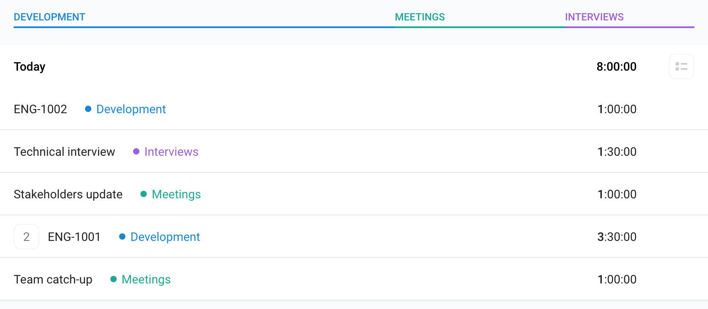

# toggl-sync

Application to synchronize Toggl entries to Jira.

At our company, logging work on Jira helps us visualize if we are focusing on the right things,
or if we are spending too much time on other work (meetings, support, etc).

Most of us use [Toggl](https://toggl.com/) for time tracking...

... but then have to spend time updating our work logs on Jira, and this is not fun to do.

This small application helps synchronizing all those Toggl entries to Jira, following very simple naming conventions.

### Naming conventions

Time entries fall into 2 categories, depending on their `Description`:
- _Project_ work: the `Description` starts with a known project prefix (e.g. `ENG`).
This is the naming convention of Jira tickets.
- _Overhead_ work: the `Description` can be anything (e.g. `Team catch-up`).
These are normally grouped together under some category (e.g. `Meetings`).
At our company, we have _overhead tickets_ to track the time spent on these type of sessions.

_Project_ work can be logged directly, but _Overhead_ work needs extra input from the user (i.e. which Jira ticket should be used to log work against).

`toggl-sync` will remember any configuration values provided by the user, so subsequent runs should be smooth and pain-free.